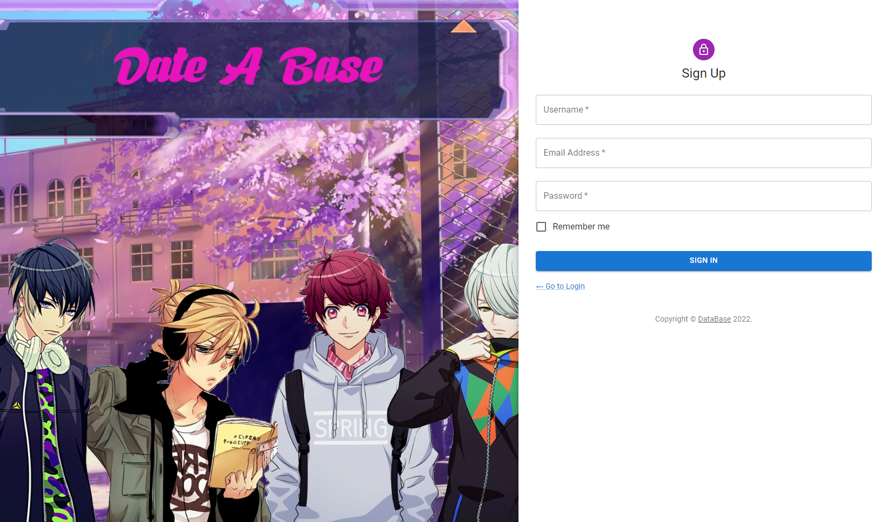
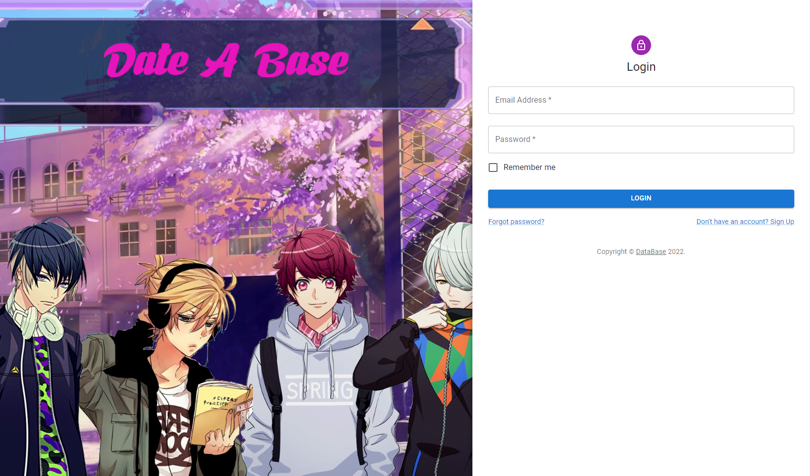
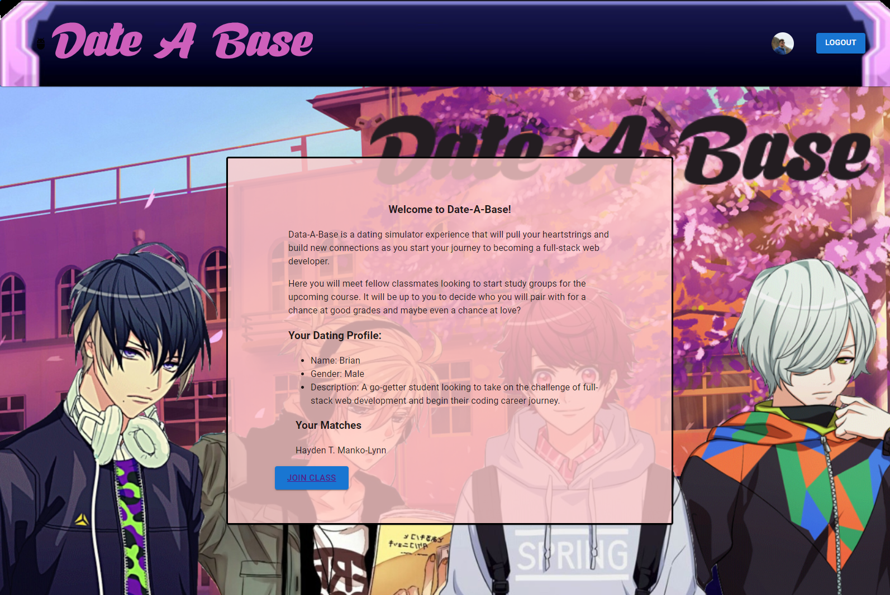
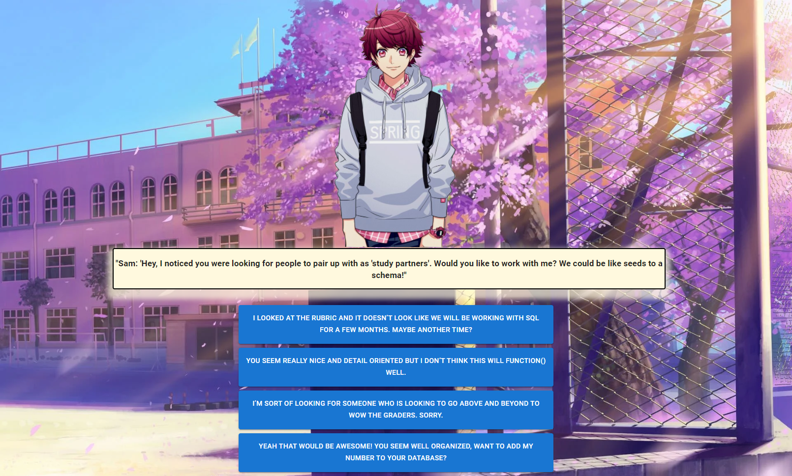
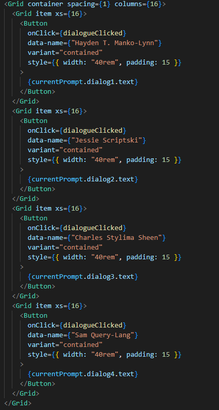
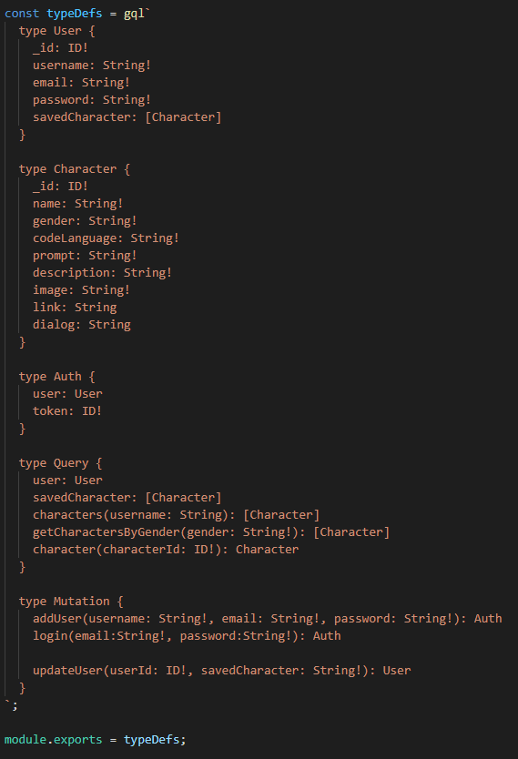
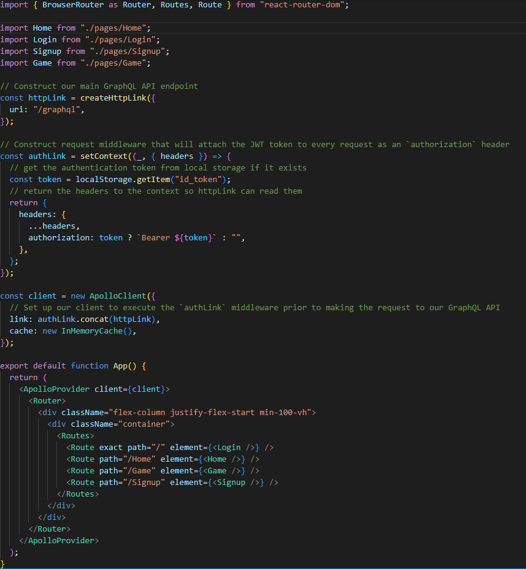

# Date-A-Base

This project was bootstrapped with [Create React App](https://github.com/facebook/create-react-app).

## USER STORY

    AS A team of web developers
    WE WANTED to create a fun and interactive gaming experience with a dating simulator that puts the user at their first day of class in the UW Full-Stack Web Development bootcamp
    SO THAT we could showcase the culmination of our skillsets and provide users with a fun and unique experience that resonated with their time in class.

## TABLE OF CONTENTS

- [DESCRIPTION](#description)
- [INSTALLATION](#installation)
- [LICENSE](#license)
- [CONTRIBUTING](#contributing)
- [QUESTIONS](#questions)

## DESCRIPTION

Data-A-Base is a dating simulator experience that will pull your heartstrings and build new connections as users start their journey to becoming a full-stack web developer. After signing up through our account authentification process with Java Web Token, the user is directed to a home screen detailing a brief synopsis of the game experience ahead and showcases where their future matches will be displayed. Once the user plays through and completes all of the dialogue interactions between characters, they will be matched with one student based on the ammount of response selections they made that pertain to that unique character. 

Some future developments we will like to include are expanded dialogue options and potential dialogue trees that change the gaming experience in a way that would showcase the emotions of characters changing based on your response selection. Say you select a response for the CSS student, the other three may now present different dialogue options based on how they feel. 

## APPLICATION IN USE

LINK TO DEPLOYED SITE CAN BE FOUND [HERE](https://calm-hamlet-19238.herokuapp.com/)

Sign Up Screen

Login Screen

Homepage

Gamepage

### Code Snippets

Data Render Code Snippet

Typedefs

App JS File

## INSTALLATION

This project utilizes node modules like `react`, `react-router-dom`, `sass`, `animate.css`, `react-scripts` and styled through `@materialui` formatting.

Once proper packages have been installed, simply run `npm run start` which will run the build script and load the portfolio site at the home page.

## LICENSE

The license included for the project is under MIT

## CONTRIBUTING

UW Full-Stack Web Development Boot Camp Class Repo - Week 20 REACT
https://uwa.bootcampcontent.com/UWA-Bootcamp/uw-blv-virt-fsf-pt-12-2021-u-c/-/tree/master/20-React

UW Full-Stack Web Development Boot Camp Class Repo - Week 21 MERN
https://uwa.bootcampcontent.com/UWA-Bootcamp/uw-blv-virt-fsf-pt-12-2021-u-c/-/tree/master/21-MERN

UW Full-Stack Web Development Boot Camp Class Repo - Week 22 State
https://uwa.bootcampcontent.com/UWA-Bootcamp/uw-blv-virt-fsf-pt-12-2021-u-c/-/tree/master/22-State

## QUESTIONS

If you have any further questions about this application or improvement ideas, please feel free to connect with us on GitHub:

- GitHub: https://github.com/NathanMilburn (Nathan Milburn)
- GitHub: https://github.com/laperolanegra10 (Daniel Juarez)
- GitHub: https://github.com/Taylor25et (Taylor Thompson)
- GitHub: https://github.com/odingol (Lamor Odingo)
- GitHub: https://github.com/Mugisha27 (Chris Mugisha)

